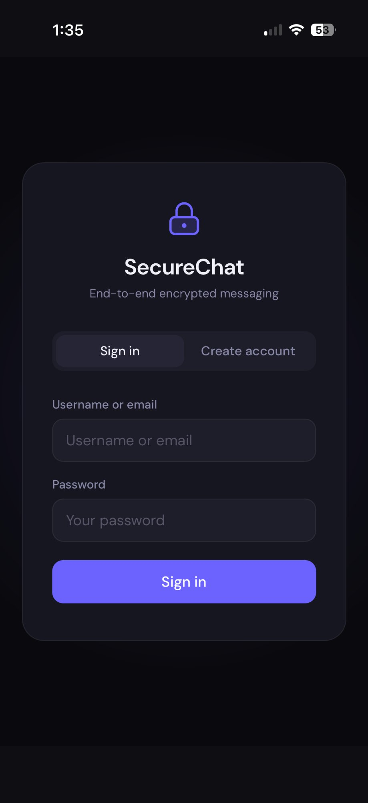
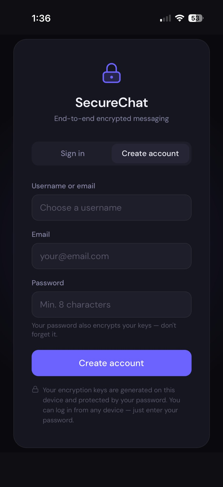
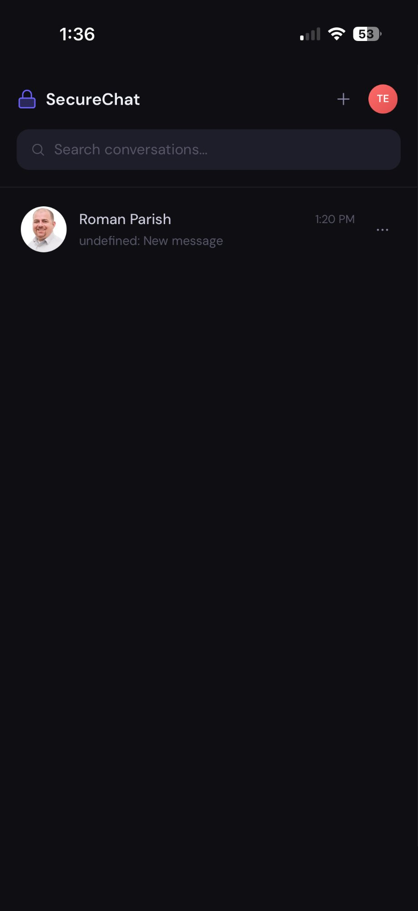
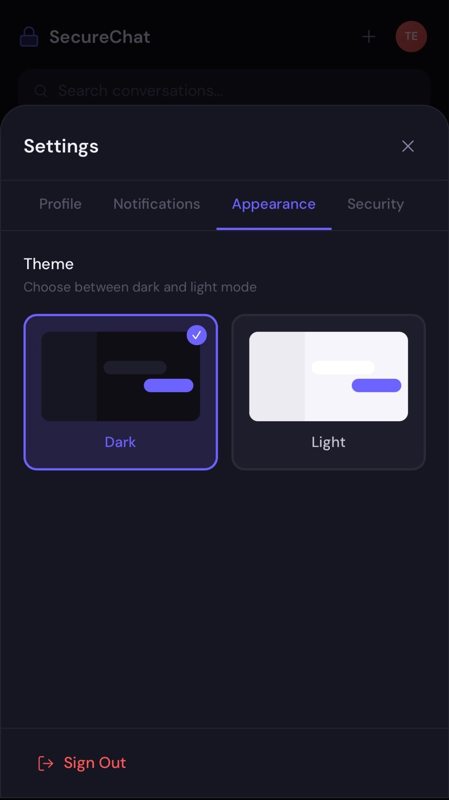
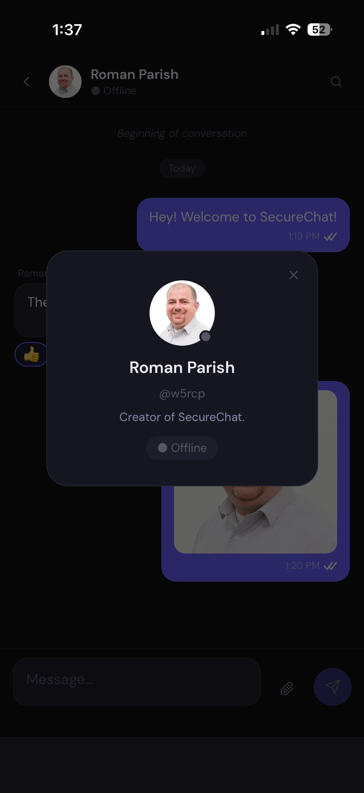
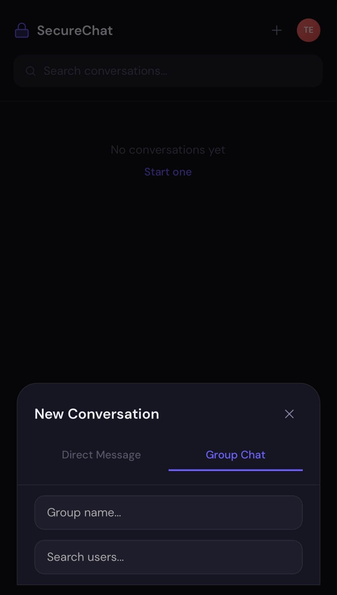
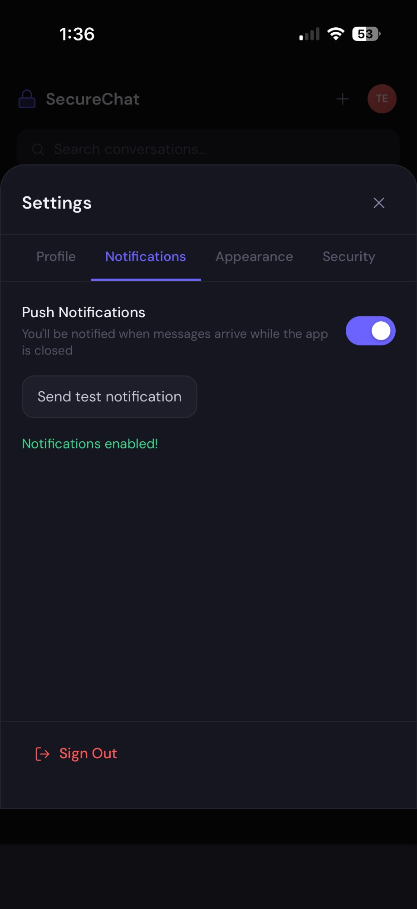
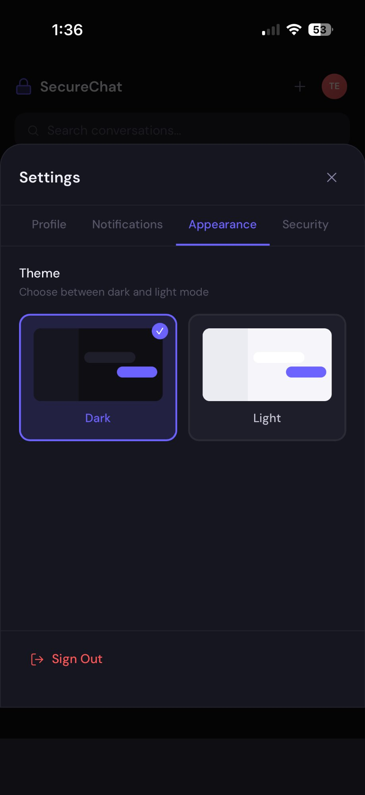
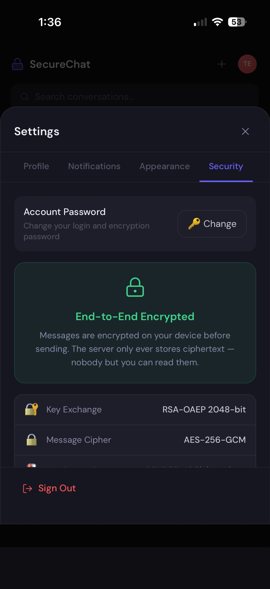
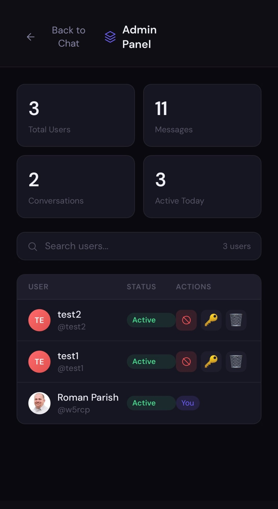

# SecureChat

> End-to-end encrypted messaging — built for privacy.

A self-hosted, fully encrypted messaging PWA. Messages are encrypted on your device before sending. The server only ever stores ciphertext — nobody but you and your contacts can read your messages.

## Screenshots

<p float="left">
  
  
  
  
</p>

<p float="left">
  
  
  
  
</p>

<p float="left">
  
  
</p>

## Features

### Messaging
- 🔒 **End-to-end encryption** — RSA-OAEP 2048-bit key exchange + AES-256-GCM message encryption
- 💬 **Real-time messaging** — instant delivery via Socket.IO
- 🎤 **Encrypted voice messages** — record and send voice clips, encrypted before upload
- 🖼️ **Encrypted image & file sharing** — files encrypted client-side, auth-protected downloads, full-screen lightbox
- 📋 **Paste to attach** — paste an image from clipboard directly into the chat input
- ↩️ **Replies, reactions, edit & delete** — full message management
- 📱 **Swipe to reply** — swipe right on any message on mobile
- ✅ **Delivery receipts** — sent, delivered, and read tick states
- 🔍 **Message search** — search by sender or filename with jump-to-message

### Conversations
- 👥 **Group chats** — admin controls, member management, online member count
- 📨 **Group invitations** — invite users with an accept/decline flow
- 🔕 **Conversation muting** — suppress push notifications per conversation
- 💬 **Unread jump button** — shows unread count, jumps to first unread message

### Notifications & Presence
- 🔔 **Push notifications** — desktop and iOS (16.4+)
- 👁️ **Last seen timestamps** — shows when a contact was last online
- ⌨️ **Typing indicators** — real-time typing state per conversation

### Privacy & Account
- 🗑️ **Account self-deletion** — permanently delete your account and all data (GDPR compliant)
- 🔑 **Password-protected key backup** — log in from any device, keys restore automatically
- 🌙 **Light/dark mode** — per-user preference saved locally

### Platform
- 📱 **PWA** — installable on iOS and Android, works offline
- 🛡️ **Admin panel** — user management, ban/suspend, reset passwords, usage stats
- 🔐 **Let's Encrypt SSL** — automatic HTTPS via setup script

## Encryption Architecture

1. On register — RSA-OAEP 2048-bit keypair generated in the browser
2. Private key wrapped with AES-256-GCM key derived from your password via PBKDF2 (100k iterations)
3. Encrypted private key stored on server — useless without your password
4. On login — encrypted key material fetched, unwrapped locally with your password
5. Messages encrypted with a per-message AES-256-GCM key, wrapped with each recipient's RSA public key
6. File attachments encrypted client-side before upload with a per-file AES-256-GCM key

**Your private key never leaves your device unencrypted. The server cannot read your messages or files.**

## Tech Stack

| Layer | Technology |
|---|---|
| Frontend | React 18 + Vite, Socket.IO client, Web Crypto API |
| Backend | Node.js + Express, Socket.IO, Pino logging |
| Database | MongoDB |
| Cache / Presence | Redis |
| Proxy | Nginx (HTTPS + CSP) |
| Infrastructure | Docker + Docker Compose |

## Quick Start

### Requirements
- Docker & Docker Compose
- A Linux server (Ubuntu 22.04 recommended)

### First time setup

```bash
git clone https://github.com/roman-parish/securechat.git
cd securechat
./setup.sh
```

`setup.sh` will automatically:
- Generate JWT secrets
- Generate VAPID keys for push notifications
- Obtain a Let's Encrypt SSL certificate (pass `--domain yourdomain.com`)
- Start all containers

### Deploying updates

```bash
git pull
./deploy.sh
```

Or just push to `main` — GitHub Actions auto-deploys to your server.

## Configuration

Copy `.env.example` to `.env` and configure:

```env
# Admin users (comma-separated usernames)
ADMIN_USERNAMES=yourname

# VAPID email for push notifications
VAPID_EMAIL=admin@yourdomain.com
```

**Never commit your `.env` file.**

## Admin Panel

Users listed in `ADMIN_USERNAMES` see an admin button in the sidebar. The admin panel provides:
- User statistics (total users, messages, active today, storage used)
- User management (view, search, suspend, delete)
- Password reset for any user
- Online indicators per user

## Changelog

See [CHANGELOG.md](CHANGELOG.md) for full release history.

## License

MIT License — Copyright (c) 2026 Roman Parish

See [LICENSE](LICENSE) for full details.

---

Built with ❤️ for privacy.
