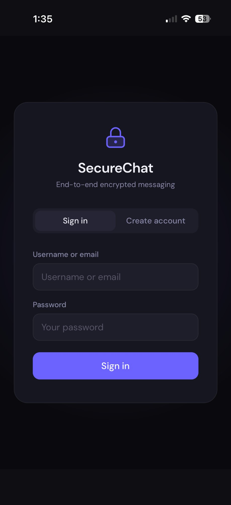
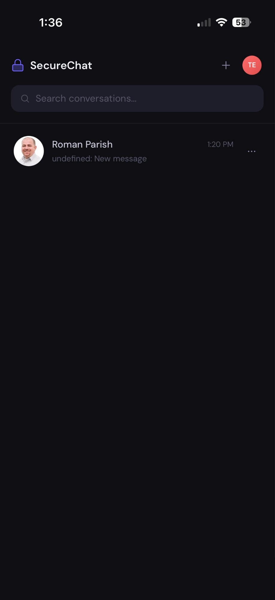
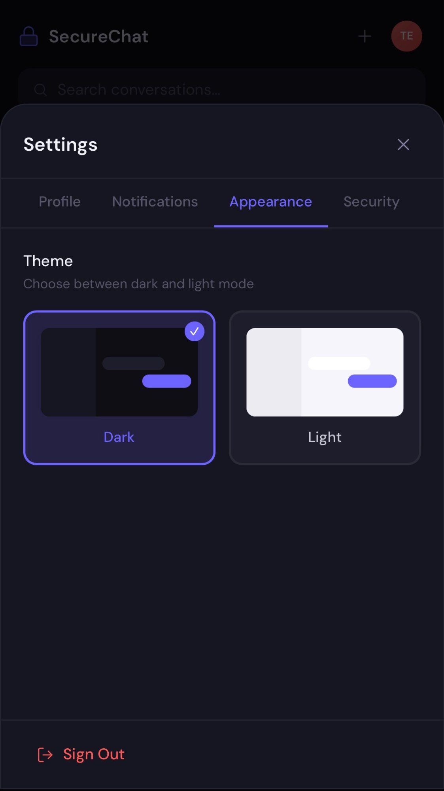
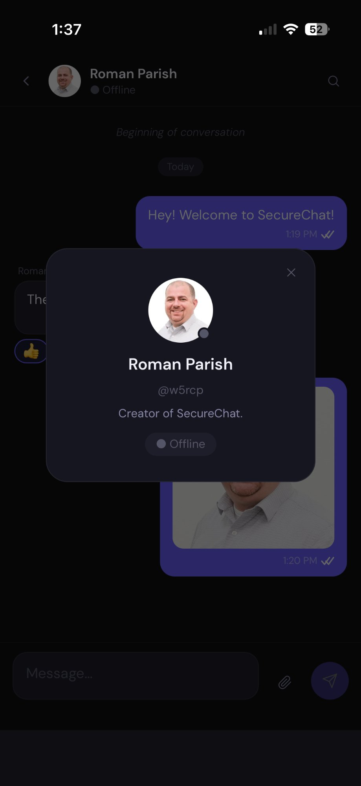
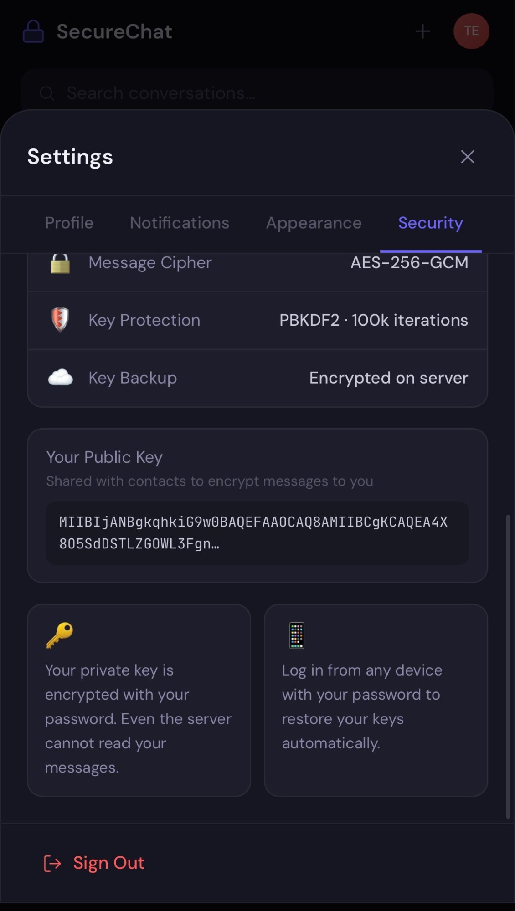
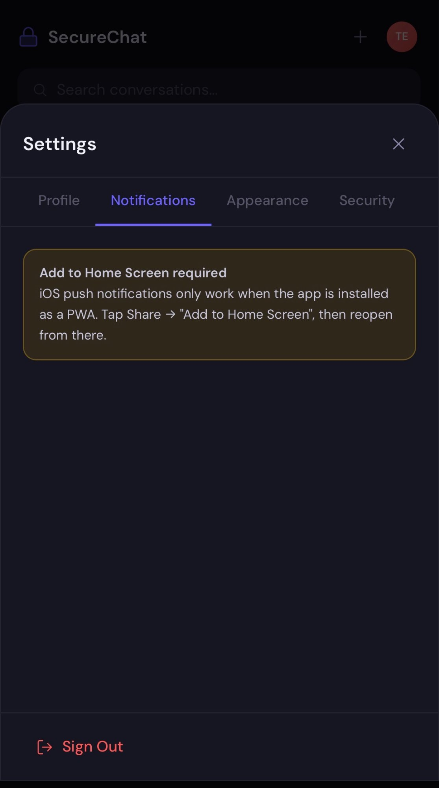
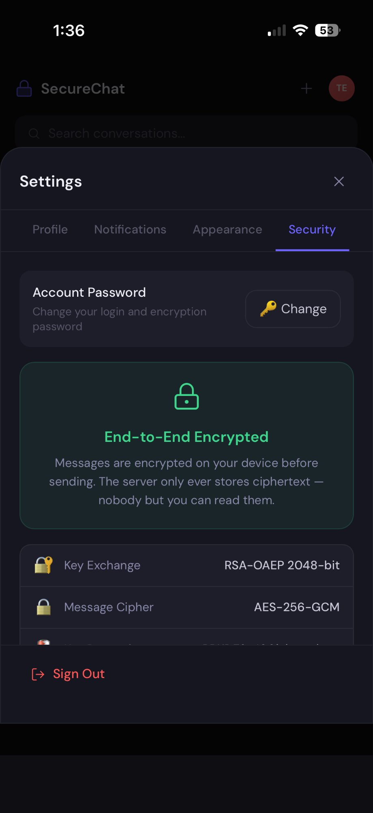
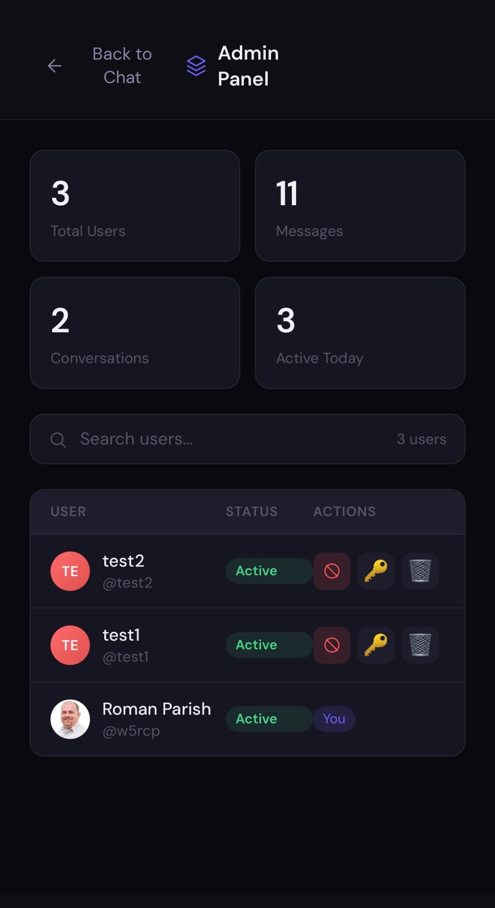

# SecureChat

> End-to-end encrypted messaging — self-hosted, open source, built for privacy.

SecureChat is a self-hosted messaging app where every message, voice clip, and file is encrypted on your device before it ever leaves. The server stores only ciphertext — nobody but you and your contacts can read your conversations, not even the server operator.

Run it on your own server in minutes with Docker. Invite people via time-limited links, manage users from the admin panel, and install it as a PWA on any device.

---

## Screenshots

<p float="left">
  
  
  
  
</p>

<p float="left">
  
  
  
  
</p>

---

## Features

### Messaging
- 🔒 **End-to-end encryption** — RSA-OAEP 2048-bit key exchange + AES-256-GCM per-message encryption
- 💬 **Real-time messaging** — instant delivery via Socket.IO
- 🎤 **Encrypted voice messages** — record and send voice clips with duration display; encrypted before upload
- 🖼️ **Encrypted file & image sharing** — files encrypted client-side, auth-protected downloads, full-screen lightbox
- 📋 **Paste to attach** — paste an image from clipboard directly into the chat input
- ↩️ **Replies, reactions, edit & delete** — full message management; reaction picker stays open for multi-react
- 📱 **Swipe to reply** — swipe right on any message on mobile
- ✅ **Delivery receipts** — sent, delivered, and read tick states; group chats show "Seen by X of Y"
- 🔍 **Message search** — search by sender or attachment filename with jump-to-message
- ⏱️ **Disappearing messages** — per-conversation auto-delete timer (1 hour, 24 hours, 7 days, 30 days)

### Conversations
- 👥 **Group chats** — admin controls, member management, promote/demote admins, group description, online member count
- 📨 **Group invitations** — invite users with an accept/decline flow; blocked users cannot be invited
- 🔕 **Conversation muting** — suppress push notifications per conversation with optional expiry
- 📦 **Conversation archive** — hide conversations without deleting; auto-unarchives on new message
- 🚫 **User blocking** — block users from messaging you; manage from profile settings
- 💬 **Unread jump button** — shows unread count, jumps to first unread message

### Notifications & Presence
- 🔔 **Push notifications** — web push on desktop and iOS (16.4+)
- 📧 **Email notifications** — login alerts, password changes, account deletion (via Resend)
- 👁️ **Last seen timestamps** — shows when a contact was last online; hide your own with the privacy toggle
- ⌨️ **Typing indicators** — real-time per-conversation typing state

### Privacy & Security
- 🔐 **Two-factor authentication** — TOTP with recovery codes, trusted devices for 30 days, and admin reset
- 🔑 **Password reset via email** — self-serve reset link with 1-hour expiry
- 🗑️ **Account self-deletion** — permanently deletes your account and all messages (GDPR compliant)
- 🙈 **Hide Last Seen** — privacy toggle to prevent contacts from seeing your last online time
- 🔑 **Password-protected key backup** — keys wrapped with your password; restore automatically on any device
- 🌙 **Light/dark mode** — per-user preference saved locally

### Admin & Platform
- 📱 **PWA** — installable on iOS (Safari → Share → Add to Home Screen) and Android (Chrome → Install App)
- 🛡️ **Admin panel** — user management, suspend/delete/password reset/2FA reset, usage stats, pagination and search
- 📋 **Audit log** — full timestamped log of admin actions with filters and pagination
- 🔗 **Invite links** — time-limited single-use links with optional email delivery; invite banner shown on auth page
- 🔒 **Registration control** — open or close new user registration from the admin panel without redeploying
- ✉️ **Email verification** — admin-controlled; admins can resend or manually verify users
- 🔐 **Let's Encrypt SSL** — automatic HTTPS via the setup script

---

## How Encryption Works

1. **On register** — a 2048-bit RSA-OAEP keypair is generated in your browser using the Web Crypto API
2. **Key wrapping** — your private key is encrypted with an AES-256-GCM key derived from your password via PBKDF2 (100,000 iterations)
3. **Server storage** — only the encrypted private key is stored on the server; it is useless without your password
4. **On login** — your encrypted key material is fetched and unwrapped locally using your password
5. **Sending a message** — a fresh AES-256-GCM key is generated per message, used to encrypt the content, then the key is wrapped with each recipient's RSA public key
6. **File attachments** — encrypted client-side with a per-file AES-256-GCM key before uploading

**Your private key never leaves your device in plaintext. The server cannot read your messages or files.**

---

## Tech Stack

| Layer | Technology |
|---|---|
| Frontend | React 18 + Vite, Socket.IO client, Web Crypto API |
| Backend | Node.js + Express, Socket.IO, Pino structured logging |
| Database | MongoDB |
| Cache / Presence | Redis |
| Proxy | Nginx (HTTPS, CSP headers) |
| Infrastructure | Docker + Docker Compose |

---

## Quick Start

### Requirements

- A Linux server (Ubuntu 22.04+ recommended)
- Docker and Docker Compose installed
- A domain name pointing to your server (optional, but required for Let's Encrypt SSL and iOS push notifications)

### 1. Clone and run setup

```bash
git clone https://github.com/roman-parish/securechat.git
cd securechat
./setup.sh
```

For HTTPS with automatic Let's Encrypt SSL (recommended for production):

```bash
./setup.sh --domain=yourdomain.com
```

`setup.sh` handles everything automatically:
- Generates secure JWT secrets, MongoDB password, and Redis password
- Generates VAPID keys for push notifications
- Issues a TLS certificate (Let's Encrypt if `--domain` is set, self-signed otherwise)
- Builds and starts all containers

> **Self-signed cert:** Without `--domain`, your browser will show a certificate warning. Click **Advanced → Proceed** to continue. Push notifications and PWA installation require a real domain with a valid cert.

### 2. Create your admin account

1. Open the app in your browser and **register your account** — the first user to register is not automatically an admin; you set this yourself
2. SSH into your server and open `.env`:
   ```bash
   nano ~/securechat/.env
   ```
3. Set `ADMIN_USERNAMES` to your username:
   ```env
   ADMIN_USERNAMES=yourusername
   ```
4. Restart the backend to pick up the change:
   ```bash
   docker compose up -d backend
   ```
5. Reload the app — you'll see an **Admin** button in the sidebar

### 3. Invite your first users

With registration closed by default, you invite people via time-limited links:

1. Open the **Admin** panel → **Settings** tab
2. Under **Registration & Access**, generate an invite link
3. Share the link — recipients see a banner showing who invited them when they open it
4. Or set `registrationOpen: true` in the admin panel to allow anyone to register

### 4. Configure email and push notifications (optional)

These are optional but unlock password reset, login alerts, and push notifications.

**Email (via [Resend](https://resend.com)):**

```env
RESEND_API_KEY=re_your_api_key_here
EMAIL_FROM=SecureChat <noreply@yourdomain.com>
```

Required for: password reset, login alerts, 2FA notifications, invite link email delivery.

**Push notifications:**

```env
VAPID_PUBLIC_KEY=...
VAPID_PRIVATE_KEY=...
VAPID_EMAIL=admin@yourdomain.com
```

`setup.sh` generates VAPID keys automatically. Push notifications require HTTPS with a valid domain (not a self-signed cert) — this is a browser requirement, not a SecureChat limitation.

After updating `.env`:

```bash
docker compose up -d backend
```

---

## Deploying Updates

```bash
git pull && ./deploy.sh
```

`deploy.sh` pulls the latest code, rebuilds containers, and restarts services with zero-downtime rolling restarts.

### Automated deploys with GitHub Actions

The included workflow (`.github/workflows/deploy.yml`) runs the full test suite and deploys to your server on every push to `main`.

Add these secrets to your GitHub repository under **Settings → Secrets and variables → Actions**:

| Secret | Value |
|---|---|
| `SERVER_HOST` | Your server's IP address or domain |
| `SERVER_USER` | SSH username (e.g. `root` or `ubuntu`) |
| `SERVER_SSH_KEY` | Contents of an SSH private key with access to the server |

The server must have the repo cloned at `~/securechat` and a valid `.env` in place before the first deploy runs.

---

## Configuration

Copy `.env.example` to `.env` and fill in your values.

```env
# ── Database ────────────────────────────────────────────────────────────────
MONGO_USER=admin
MONGO_PASSWORD=change_this_mongo_password

# ── Redis ───────────────────────────────────────────────────────────────────
REDIS_PASSWORD=change_this_redis_password

# ── JWT Secrets (generate with: openssl rand -hex 64) ───────────────────────
JWT_SECRET=change_this_jwt_secret_in_production
JWT_REFRESH_SECRET=change_this_refresh_secret_in_production

# ── Web Push / VAPID (generate with: npx web-push generate-vapid-keys) ──────
VAPID_PUBLIC_KEY=
VAPID_PRIVATE_KEY=
VAPID_EMAIL=admin@yourdomain.com

# ── Email — Resend (https://resend.com) ─────────────────────────────────────
RESEND_API_KEY=re_your_api_key_here
EMAIL_FROM=SecureChat <noreply@yourdomain.com>

# ── App URL ─────────────────────────────────────────────────────────────────
# Must match your domain — used for CORS, push notification links, and emails
CLIENT_URL=https://yourdomain.com

# ── Ports ───────────────────────────────────────────────────────────────────
HTTP_PORT=80
HTTPS_PORT=443

# ── Admin ───────────────────────────────────────────────────────────────────
# Comma-separated usernames with access to the admin panel
# Must be set on both frontend (build arg) and backend (env var)
ADMIN_USERNAMES=yourusername

# ── Node environment ────────────────────────────────────────────────────────
NODE_ENV=production
```

> **Never commit your `.env` file.** Generate all secrets fresh — never use the placeholder values in production.

### Required vs optional

| Variable | Required | Purpose |
|---|---|---|
| `MONGO_PASSWORD` | Yes | Change before first run |
| `REDIS_PASSWORD` | Yes | Change before first run |
| `JWT_SECRET` | Yes | Access token signing |
| `JWT_REFRESH_SECRET` | Yes | Refresh token signing |
| `CLIENT_URL` | Yes | CORS origin, email links, push notification URLs |
| `ADMIN_USERNAMES` | Yes | Comma-separated list of admin usernames |
| `VAPID_PUBLIC_KEY` | Optional | Required for push notifications |
| `VAPID_PRIVATE_KEY` | Optional | Required for push notifications |
| `VAPID_EMAIL` | Optional | Required for push notifications |
| `RESEND_API_KEY` | Optional | Required for all email features |
| `EMAIL_FROM` | Optional | Required alongside `RESEND_API_KEY` |

---

## Admin Panel

Users listed in `ADMIN_USERNAMES` see an **Admin** button in the sidebar. The variable controls both the UI and the backend API.

The admin panel provides:

**Stats tab** — total users, messages, active users today, storage used, message activity chart

**Users tab** — search and filter all users; tap any user to:
- View profile and last seen
- Suspend or delete the account
- Reset password (sends an email reset link)
- Reset 2FA (for locked-out users)
- Manually verify email

**Settings tab** — toggle open/close registration, generate and revoke time-limited invite links with optional email delivery, configure email notification preferences

**Audit Log tab** — full timestamped log of all admin actions with search and pagination

---

## Troubleshooting

**Push notifications not working**
- Requires HTTPS with a valid domain (not self-signed)
- On iOS, the app must be installed as a PWA (Add to Home Screen) and iOS 16.4+
- Check that `VAPID_*` keys are set and the backend was restarted after adding them

**Password reset emails not arriving**
- Verify `RESEND_API_KEY` and `EMAIL_FROM` are set in `.env`
- Check that your Resend account has the sending domain verified
- Restart the backend after any `.env` changes: `docker compose up -d backend`

**Admin panel returns 403**
- `ADMIN_USERNAMES` must be set in `.env` and passed to both the frontend build and the backend container
- After changing it, rebuild: `docker compose up -d --build`

**Certificate warning on first load**
- Expected when using a self-signed cert (no `--domain` flag)
- Re-run `./setup.sh --domain=yourdomain.com` once your domain is pointed at the server

**Messages not decrypting after password change**
- Keys are re-wrapped on password change — if you see decryption errors, log out and back in to re-fetch the updated key material

---

## Changelog

See [CHANGELOG.md](CHANGELOG.md) for full release history.

---

## License

MIT License — Copyright (c) 2026 Roman Parish

See [LICENSE](LICENSE) for full details.

---

Built for privacy.
